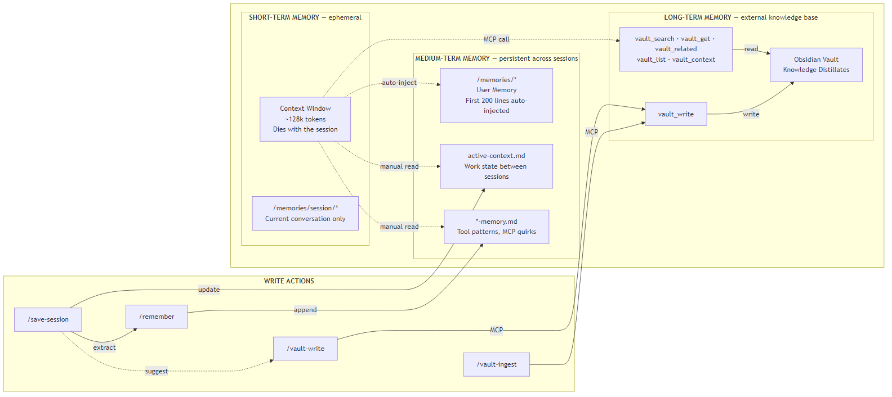

# Copilot Memory Stack

**Persistent context for AI coding agents across sessions.**

GitHub Copilot's context window resets with every new chat session. This repository provides a working pattern to give your AI agent **short-term, medium-term, and long-term memory** — so it remembers decisions, patterns, and domain knowledge across sessions.



## The Problem

AI coding assistants forget everything when you close the chat. Every new session starts from zero — no knowledge of yesterday's decisions, no recall of patterns you taught it, no access to curated domain knowledge.

VS Code's built-in Copilot Memory helps, but it only covers **one tier** (auto-injected user preferences). For serious work, you need all three tiers.

## The Three Tiers

| Tier | Scope | Lifetime | Mechanism |
|---|---|---|---|
| **Short-term** | Context Window + Session Memory | Current session only | VS Code built-in (`/memories/session/`) |
| **Medium-term** | User Memory + Repo Memory | Persists across sessions | VS Code built-in (`/memories/`, `/memories/repo/`) |
| **Long-term** | Obsidian Vault via MCP | Persists forever, searchable | Custom MCP server (`vault-mcp`) |

## What's In This Repo

```
.github/
├── copilot-instructions.md              # Entry point for Copilot
├── instructions/
│   ├── memory-system.instructions.md    # How the 3-tier memory works
│   └── vault-knowledge.instructions.md  # How to search and write to the vault
└── prompts/
    ├── save-session.prompt.md           # /save-session — persist session state
    ├── remember.prompt.md               # /remember — store learnings
    ├── vault-write.prompt.md            # /vault-write — write to long-term vault
    └── vault-ingest.prompt.md           # /vault-ingest — distill docs into vault

vault-mcp/                               # MCP server for Obsidian vault access
├── pyproject.toml
└── src/vault_mcp/
    ├── __init__.py
    ├── vault.py                         # Index + read/write logic
    └── server.py                        # MCP tool definitions

example-vault/                           # 3 example documents to get started
assets/                                  # Architecture diagram
```

## Quick Start

### 1. Copy the instructions and prompts

Copy `.github/` into your workspace. Copilot will pick up the instructions automatically.

### 2. Set up vault-mcp (optional — for long-term memory)

```bash
cd vault-mcp
pip install -e .
```

Add to your `.vscode/mcp.json`:

```json
{
  "servers": {
    "vault-mcp": {
      "type": "stdio",
      "command": "python",
      "args": ["-m", "vault_mcp.server"],
      "env": {
        "VAULT_ROOT": "/path/to/your/obsidian-vault/curated"
      }
    }
  }
}
```

### 3. Seed your vault

Copy the files from `example-vault/` into your vault directory, or use `/vault-write` in chat to create your first document.

### 4. Use the prompts

| Prompt | What it does |
|---|---|
| `/save-session` | Saves session state + thought process to `active-context.md` |
| `/remember` | Stores a learning in domain-specific memory files |
| `/vault-write [domain] [title]` | Distills a session insight into the vault |
| `/vault-ingest [file] [domain]` | Extracts knowledge from a source document |

## How It Works

### Short-term: Context Window

The context window (~128k tokens) is your working memory. It dies when the session ends. Session memory (`/memories/session/`) extends this slightly but is also ephemeral.

### Medium-term: Copilot Memory

VS Code's built-in memory system provides two persistent scopes:

- **User Memory** (`/memories/`): Cross-workspace, first 200 lines auto-injected into every session
- **Repo Memory** (`/memories/repo/`): Workspace-specific, must be read manually

The `/save-session` prompt writes to `active-context.md` in repo memory — preserving your work state, decisions, and open questions. The `/remember` prompt stores tool patterns and process learnings.

### Long-term: Obsidian Vault via MCP

For durable, searchable domain knowledge, the `vault-mcp` server exposes a local Obsidian vault as MCP tools:

| Tool | Direction | Purpose |
|---|---|---|
| `vault_search` | Read | Full-text search |
| `vault_get` | Read | Fetch single document by ID |
| `vault_related` | Read | Graph traversal via wikilinks |
| `vault_list` | Read | List/filter by tags |
| `vault_context` | Read | LLM-ready context block |
| `vault_write` | Write | Create new document with frontmatter |

Documents are plain Markdown with YAML frontmatter — no proprietary format, no database, no indexing process. The vault is just a folder of `.md` files.

## The Write Actions

Knowledge flows into the three tiers through dedicated prompts:

| What | Prompt | Target |
|---|---|---|
| Session state, thought process, open questions | `/save-session` | `active-context.md` (medium-term) |
| Tool patterns, process quirks | `/remember` | `*-memory.md` (medium-term) |
| Distilled domain knowledge with provenance | `/vault-write` | Obsidian Vault (long-term) |

## Adapting to Your Project

The instructions and prompts use generic domain names. To customize:

1. Edit the domain tags in `vault-write.prompt.md` and `remember.prompt.md`
2. Adjust the memory domains in `remember.prompt.md` to match your project structure
3. Point `VAULT_ROOT` to your own Obsidian vault or any folder of Markdown files

## License

MIT
